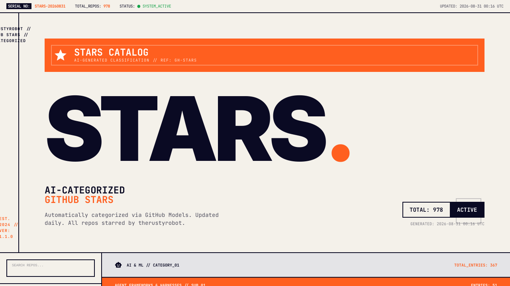
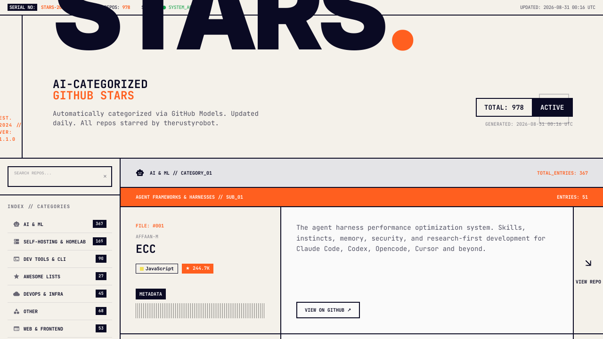

# github-stars-gallery

Turns your GitHub starred repos into a searchable, browsable static site — organized into categories by an LLM, rebuilt automatically every day, and hosted free on GitHub Pages.

**Live example:** https://therustyrobot.github.io/github-stars-gallery/





## What it does

1. Fetches every repo you've starred (skips forks and archived repos)
2. Classifies each one into a category/subcategory using an LLM (via OpenRouter)
3. Generates a single static `index.html` with client-side search and category filtering
4. Commits the result and publishes it via GitHub Pages
5. Repeats daily on a schedule — new stars appear automatically, nothing to run by hand

## How it works

Three scripts, run in order by a GitHub Actions workflow:

| Script | Purpose |
|---|---|
| `scripts/fetch_stars.py` | Pulls your starred repos from the GitHub API → `_data/repos.json` |
| `scripts/categorize.py` | Sends new/changed repos to an LLM for categorization → `_data/categories.json` (only categorizes repos not already classified, so re-runs are cheap) |
| `scripts/generate.py` | Renders `_data/repos.json` + `_data/categories.json` into `docs/index.html` |

`.github/workflows/update-gallery.yml` runs this pipeline daily (`cron: '0 6 * * *'`) and on manual dispatch, then commits any changes back to the repo.

## Setup

### 1. Fork this repo

### 2. Enable GitHub Pages

Repo **Settings → Pages** → Source: **Deploy from a branch** → Branch: `main`, folder: `/docs`.

### 3. Add repository secrets

**Settings → Secrets and variables → Actions → New repository secret**

| Secret | What it's for | How to get one |
|---|---|---|
| `STARS_TOKEN` | Reads your starred repos | GitHub → Settings → Developer settings → Personal access tokens → generate a classic token. No scopes needed if all your stars are on public repos. |
| `OPENROUTER_API_KEY` | Categorizes repos via LLM | Sign up at [openrouter.ai](https://openrouter.ai), grab an API key from your dashboard. The included model (`openrouter/free`) costs nothing to use — the key is just required to authenticate. |

`GITHUB_TOKEN` is provided automatically by Actions and needs no setup — it's only used to commit the generated site back to the repo, and requires `contents: write` permission (already set in the workflow).

### 4. Run it

**Actions** tab → **Update Gallery** → **Run workflow**. After it finishes (~1-2 min), your site is live at `https://<your-username>.github.io/github-stars-gallery/`.

After that, it re-runs automatically every day at 06:00 UTC.

## Running locally

```bash
pip install requests
export STARS_TOKEN=<your github pat>
export OPENROUTER_API_KEY=<your openrouter key>

python3 scripts/fetch_stars.py
python3 scripts/categorize.py
python3 scripts/generate.py
```

Open `docs/index.html` in a browser to preview.

## Tests

```bash
pip install pytest
pytest
```

## Customizing

- **Categories/taxonomy** — edit the `SYSTEM_PROMPT` in `scripts/categorize.py`.
- **Model** — change `MODEL` in `scripts/categorize.py`. Defaults to `openrouter/free` (OpenRouter's free-model router); swap in any [OpenRouter model ID](https://openrouter.ai/models) if you want more consistent categorization quality.
- **Schedule** — edit the `cron` expression in `.github/workflows/update-gallery.yml`.
- **Site design** — `scripts/generate.py` renders the HTML directly (no templating engine); tweak the markup/CSS there.
